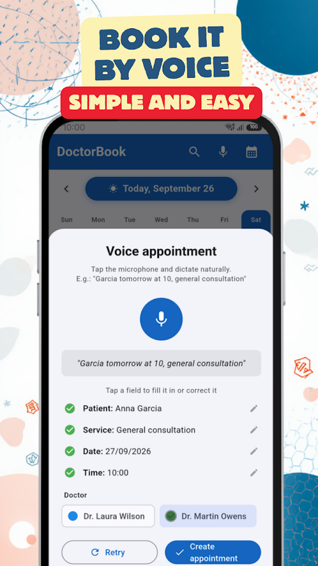
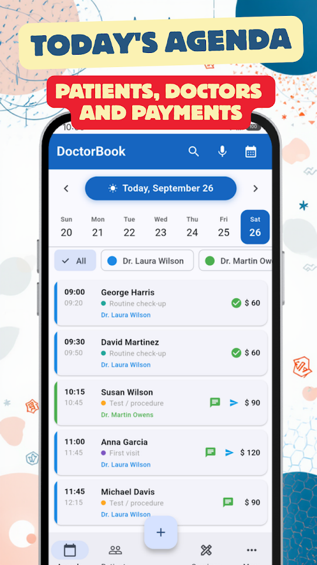
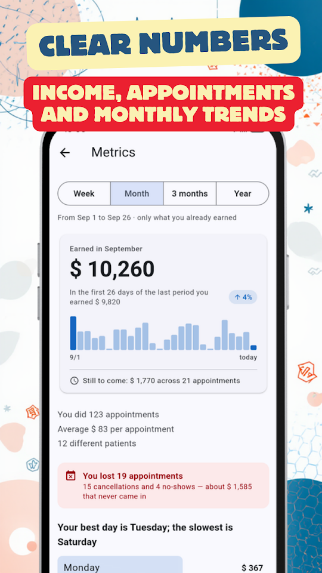
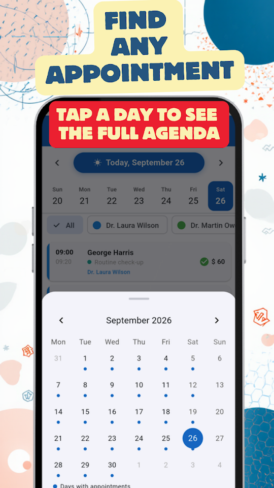

  
  <h1>DoctorBook - Health Agenda</h1>
  
<b>Appointment book for doctors & health professionals. Patients & metrics.</b>

  

  
<a href="README.md">🇦🇷 Español</a> · 🇺🇸 English · <a href="README-pt.md">🇧🇷 Português</a> · <a href="README-it.md">🇮🇹 Italiano</a>

  
  
  
  

Doctors, dentists, physiotherapists, psychologists, nutritionists and more: manage your practice without the hassle.

## 📅 SMART SCHEDULE

See all your appointments at a glance. Swipe to change dates, tap to view details. Reschedule, cancel or delete appointments individually or in bulk.

## 🎙️ VOICE BOOKING

Add appointments by speaking: "Johnson tomorrow at 10 general consultation". The app recognizes the name, date, time and type of visit automatically.

## 💬 WHATSAPP REMINDERS

Send reminders to your patients with a single tap. Customize templates with name, service, date and time.

## 🔔 NEXT-DAY ALERT

Every evening you receive a notification with tomorrow's appointment count so you can plan ahead.

## 👥 PATIENT PROFILES

Visit history, internal notes and patient classification. Import contacts directly from your phone.

## 📊 PRACTICE METRICS

Revenue charts, most frequent visits, best patients and comparison with previous periods. Filter by week, month, quarter or year.

## 🔒 YOUR PATIENTS' DATA ON YOUR PHONE

It is stored only on your phone, with no external servers and no sign-up. It is never shared with anyone.
DoctorBook is NOT an electronic health records system — it's an appointment management tool.

- Free, with ads: unlimited appointments, up to 50 patients, 15 services and 3 professionals
- Voice booking, WhatsApp reminders and metrics at no cost
- No mandatory sign-up
- Works offline

## ⭐ DOCTORBOOK PRO

No ads. Unlimited patients, services and professionals, plus a backup you can carry to another phone. 7 days free; cancel anytime from Google Play.

Developed by EgeaINC — Gabriel Egea.

---

## 📋 What's new

Every change, version by version: [CHANGELOG](CHANGELOG-en.md).

## 💬 Feedback and issues

Found a bug or have an idea? Open an [issue](https://github.com/gabriel600r/docbook-feedback/issues/new) or write to us from the app (More → Send feedback or report).

## 🔒 Privacy

Your agenda is stored only on your phone. The free version shows Google AdMob ads; PRO removes them. Details in the [privacy policy](PRIVACY_POLICY.md).
