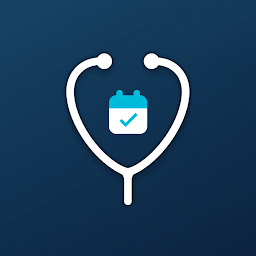
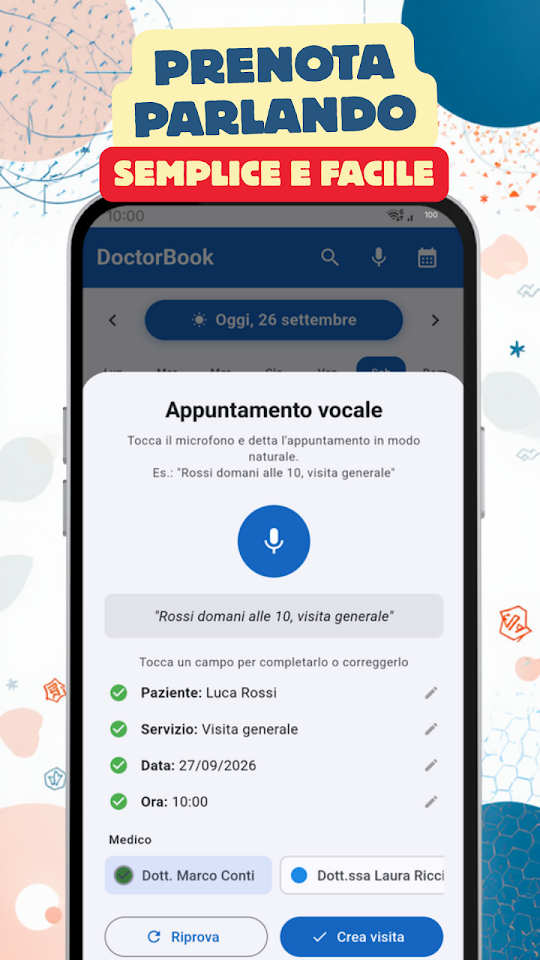
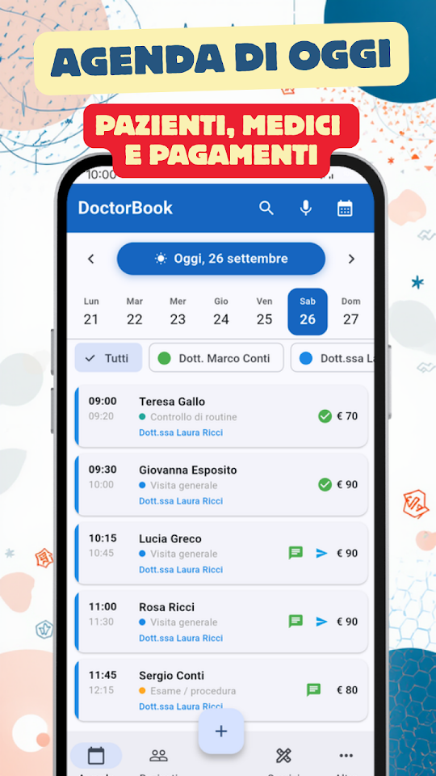
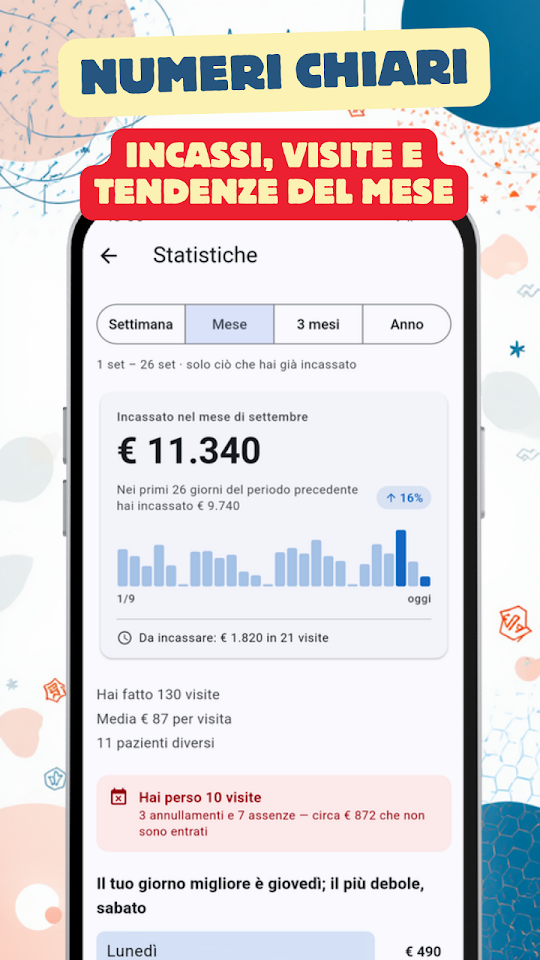
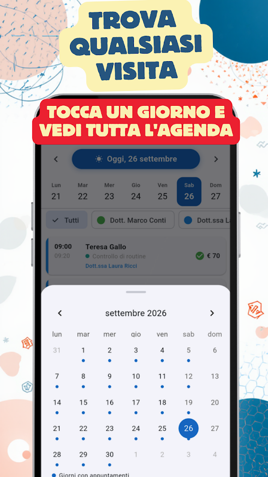

  
  <h1>DoctorBook - Agenda Salute</h1>
  
<b>🇮🇹 Agenda per medici e professionisti sanitari. Pazienti, visite e metriche.</b>

  

  
<a href="README.md">🇦🇷 Español</a> · <a href="README-en.md">🇺🇸 English</a> · <a href="README-pt.md">🇧🇷 Português</a> · 🇮🇹 Italiano

  
  
  
  

Medici, dentisti, fisioterapisti, psicologi, nutrizionisti e non solo: gestisci il tuo studio senza complicazioni.

## 📅 AGENDA INTELLIGENTE

Visualizza tutti i tuoi appuntamenti del giorno in un colpo d'occhio. Scorri per cambiare data, tocca per vedere i dettagli. Riprogramma, annulla o elimina appuntamenti singolarmente o in blocco. Aggiungi più servizi alla stessa visita: durata e prezzo si sommano da soli.

## 🎙️ PRENOTAZIONE VOCALE

Aggiungi appuntamenti parlando: "Rossi domani alle 10 visita generale". L'app riconosce automaticamente il nome, la data, l'ora e il tipo di visita.

## 📲 RICHIESTE SU WHATSAPP

Condividi il tuo link o il tuo codice QR perché i pazienti ti chiedano una visita su WhatsApp, con il messaggio già scritto. E invia gli orari che hai ancora liberi, pronti con un tocco.

## 💬 PROMEMORIA WHATSAPP

Invia promemoria ai tuoi pazienti con un solo tocco. Personalizza i modelli con nome, servizio, data e orario.

## 🔔 AVVISO DEL GIORNO DOPO

Ogni sera ricevi una notifica con il numero di appuntamenti del giorno successivo per arrivare preparato.

## 👥 SCHEDA PAZIENTE

Storico visite, note interne e classificazione per tipo di paziente. Importa contatti direttamente dal telefono.

## 📊 METRICHE DELLO STUDIO

Grafici di fatturato, visite più frequenti, migliori pazienti e confronto con periodi precedenti. Filtra per settimana, mese, trimestre o anno.

## 🔒 I DATI DEI TUOI PAZIENTI NEL TUO TELEFONO

Restano solo nel telefono, senza server esterni né registrazione. Non vengono mai condivisi con nessuno.
DoctorBook NON è un sistema di cartelle cliniche elettroniche — è uno strumento di gestione appuntamenti.

## 🇮🇹 DISPONIBILE IN ITALIANO

DoctorBook è completamente in italiano — interfaccia, notifiche, promemoria e ogni funzione. Pensata per il mercato italiano, parla la tua lingua.

- Gratis, con pubblicità: appuntamenti illimitati, fino a 50 pazienti, 15 servizi e 3 professionisti
- Appuntamenti vocali, promemoria WhatsApp e metriche, senza costi
- Link e QR per ricevere richieste su WhatsApp, e orari liberi pronti da inviare
- Nessuna registrazione obbligatoria
- Funziona offline

## ⭐ DOCTORBOOK PRO

Senza pubblicità. Pazienti, servizi e professionisti senza limite, più il backup per portare tutto su un altro telefono. 7 giorni gratis; annulli quando vuoi da Google Play.

Sviluppato da EgeaINC — Gabriel Egea.

---

## 📋 Novità

Tutto ciò che è cambiato, versione per versione: [CHANGELOG](CHANGELOG-it.md).

## 💬 Suggerimenti e problemi

Hai trovato un errore o hai un'idea? Apri una [issue](https://github.com/gabriel600r/docbook-feedback/issues/new) o scrivici dall'app (Altro → Invia suggerimento o segnalazione).

## 🔒 Privacy

La tua agenda resta solo nel telefono. La versione gratuita mostra annunci Google AdMob; PRO li toglie. Dettagli nell'[informativa sulla privacy](PRIVACY_POLICY.md).
