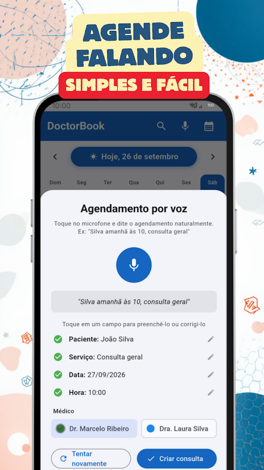
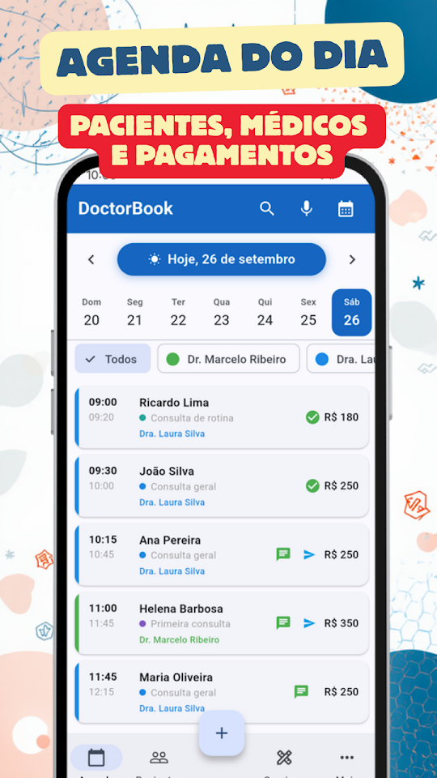
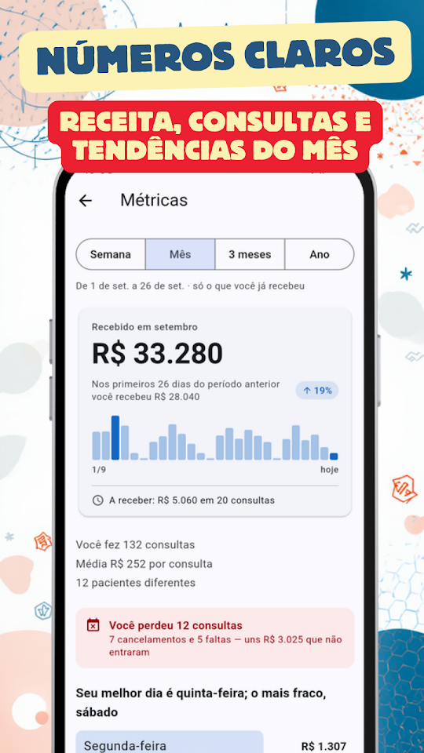
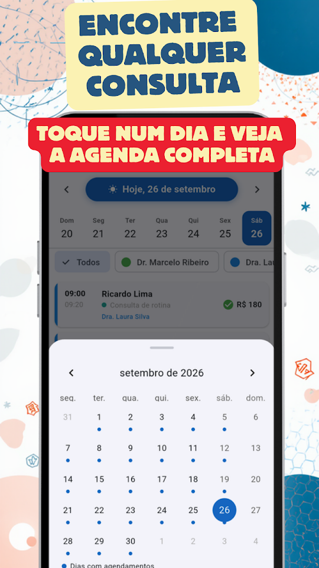

  
  <h1>DoctorBook - Agenda Saúde</h1>
  
<b>🇧🇷 Agenda de consultas para médicos e profissionais de saúde — em português!</b>

  

  
<a href="README.md">🇦🇷 Español</a> · <a href="README-en.md">🇺🇸 English</a> · 🇧🇷 Português · <a href="README-it.md">🇮🇹 Italiano</a>

  
  
  
  

Médicos, odontólogos, fisioterapeutas, psicólogos, nutricionistas e mais: organize seu consultório sem complicações.

## 📅 AGENDA INTELIGENTE

Visualize todos os seus atendimentos do dia de relance. Deslize para mudar de data, toque para ver os detalhes. Remarque, cancele ou exclua consultas de forma individual ou em lote.

## 🎙️ AGENDAMENTO POR VOZ

Cadastre consultas falando: "Silva amanhã às 10 consulta geral". O app reconhece o nome, a data, o horário e o tipo de atendimento automaticamente.

## 💬 LEMBRETES VIA WHATSAPP

Envie lembretes aos seus pacientes com um único toque. Personalize os modelos com nome, serviço, data e horário.

## 🔔 AVISO DO DIA SEGUINTE

Toda noite você recebe uma notificação com a quantidade de consultas do próximo dia para chegar preparado.

## 👥 FICHA DO PACIENTE

Histórico de visitas, anotações internas e classificação por tipo de paciente. Importe contatos diretamente do seu telefone.

## 📊 MÉTRICAS DO CONSULTÓRIO

Gráficos de faturamento, consultas mais frequentes, melhores pacientes e comparativo com períodos anteriores. Filtre por semana, mês, trimestre ou ano.

## 🔒 OS DADOS DOS SEUS PACIENTES NO SEU TELEFONE

Ficam só no seu telefone, sem servidores externos e sem cadastro. Nunca são compartilhados com ninguém.
DoctorBook NÃO é um sistema de prontuários — é uma ferramenta de gestão de consultas.

- Grátis, com anúncios: consultas ilimitadas, até 50 pacientes, 15 serviços e 3 profissionais
- Agendamento por voz, lembretes WhatsApp e métricas, sem custo
- Sem cadastro obrigatório
- Funciona sem internet

## ⭐ DOCTORBOOK PRO

Sem anúncios. Pacientes, serviços e profissionais sem limite, além de backup para levar tudo para outro celular. 7 dias grátis; cancele quando quiser no Google Play.

Desenvolvido por EgeaINC — Gabriel Egea.

## 🇧🇷 APP 100% EM PORTUGUÊS DO BRASIL

O DoctorBook foi totalmente traduzido para o português do Brasil. Interface, notificações, lembretes e suporte — tudo no seu idioma.

---

## 📋 Novidades

Tudo o que mudou, versão por versão: [CHANGELOG](CHANGELOG-pt.md).

## 💬 Sugestões e problemas

Encontrou um erro ou tem uma ideia? Abra uma [issue](https://github.com/gabriel600r/docbook-feedback/issues/new) ou escreva pelo app (Mais → Enviar sugestão ou reporte).

## 🔒 Privacidade

Sua agenda fica só no seu telefone. A versão grátis mostra anúncios do Google AdMob; o PRO tira os anúncios. Detalhes na [política de privacidade](PRIVACY_POLICY.md).
