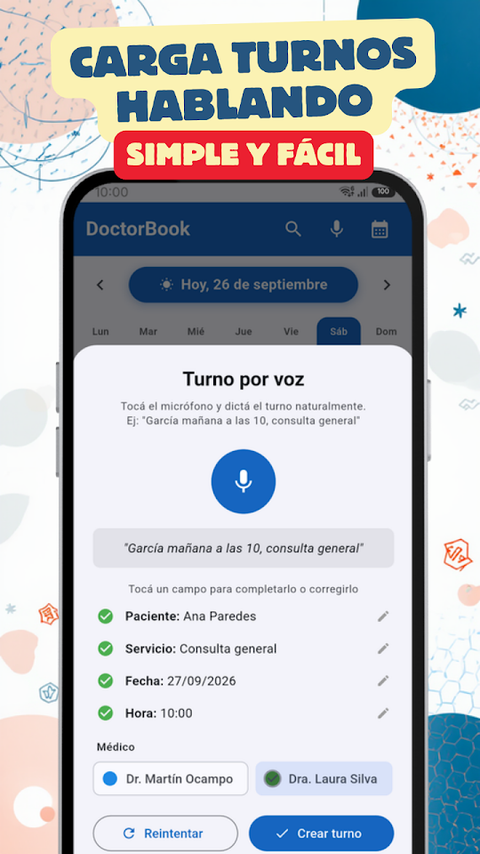
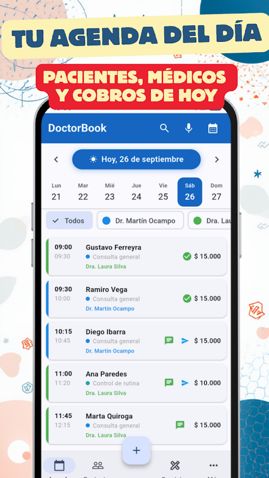
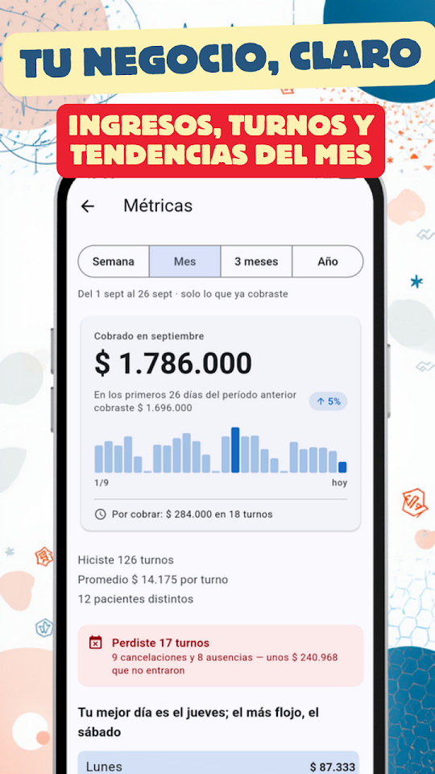
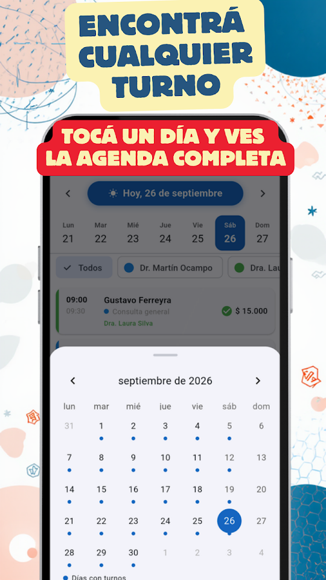

  
  <h1>DoctorBook - Agenda Consultas</h1>
  
<b>Agenda de turnos para profesionales de la salud. Pacientes, turnos y métricas.</b>

  

  
🇦🇷 Español · <a href="README-en.md">🇺🇸 English</a> · <a href="README-pt.md">🇧🇷 Português</a> · <a href="README-it.md">🇮🇹 Italiano</a>

  
  
  
  

Médicos, odontólogos, kinesiólogos, psicólogos, nutricionistas y más: organizá tu consultorio sin complicaciones y sin perder tiempo.

## 📅 AGENDA INTELIGENTE

Visualizá todos tus turnos del día de un vistazo. Deslizá para cambiar de fecha, tocá para ver los detalles. Reprogramá, cancelá o eliminá turnos de forma individual o en lote.

## 🎙️ TURNOS POR VOZ

Cargá turnos hablando: "García mañana a las 10 consulta general". La app reconoce el nombre, la fecha, la hora y el tipo de consulta automáticamente.

## 💬 RECORDATORIOS POR WHATSAPP

Enviá recordatorios a tus pacientes con un solo toque. Personalizá las plantillas con nombre, servicio, fecha y hora.

## 🔔 AVISO DEL DÍA SIGUIENTE

Cada noche recibís una notificación con la cantidad de turnos del día siguiente para que llegues preparado.

## 👥 FICHA DE PACIENTES

Historial de visitas, notas internas y clasificación por tipo de paciente. Importá contactos directamente desde tu teléfono.

## 📊 MÉTRICAS DE TU CONSULTORIO

Gráficos de ingresos, consultas más frecuentes, mejores pacientes y comparativa con períodos anteriores. Filtrá por semana, mes, trimestre o año.

## 🔒 LOS DATOS DE TUS PACIENTES, EN TU TELÉFONO

Se guardan sólo en tu teléfono, sin servidores externos ni registro. Nunca se comparten con nadie.
DoctorBook NO es un sistema de historias clínicas — es una herramienta de gestión de turnos.

- Gratis, con publicidad: turnos ilimitados, hasta 50 pacientes, 15 servicios y 3 profesionales
- Turnos por voz, recordatorios WhatsApp y métricas, sin costo
- Sin registro obligatorio
- Funciona sin internet

## ⭐ DOCTORBOOK PRO

Sin publicidad. Pacientes, servicios y profesionales sin límite, más copia de seguridad para llevarte todo a otro teléfono. 7 días gratis; cancelás cuando quieras desde Google Play.

Desarrollada por EgeaINC — Gabriel Egea.

---

## 📋 Novedades

Todo lo que cambió, versión por versión: [CHANGELOG](CHANGELOG.md).

## 💬 Sugerencias y problemas

¿Encontraste un error o tenés una idea? Abrí un [issue](https://github.com/gabriel600r/docbook-feedback/issues/new) o escribinos desde la app (Más → Enviar sugerencia o reporte).

## 🔒 Privacidad

Tu agenda se guarda sólo en tu teléfono. La versión gratis muestra publicidad de Google AdMob; PRO la saca. Detalles en la [política de privacidad](PRIVACY_POLICY.md).
